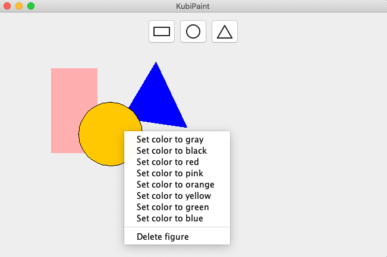

# JavaPaint
Prosty edytor graficzny dla kubistów

Funkcjonalność

1. Zasadniczą funkcjonalnością programu jest możliwość rysowania figur. W tym celu należy wybrać jedną z dostępnych na górnym panelu figur (prostokąt, koło, trójkąt), następnie korzystając z myszy ustalić jej granice. Aby przerwać rysowanie figury należy nacisnać prawy przycisk myszy.
2. Figurę można oznaczyć jako aktywną, wówczas jest ona wyróżniana tzn. rysuje się na niej obramowanie oraz przy nakładaniu się figur jest na górze.
3. Położenie aktywnej figury można zmienić, aby to zrobić należy kliknąć na nią lewym przyciskiem myszy i przytrzymując przycisk zmienić jej położenie.
4. Rozmiar aktywnej figury można zmienić ruszając scrollem, do dołu aby powiekszyć, do góry aby zmniejszyć.
5. Kliknięcie prawym przyciskiem myszy na aktywną figurę spowoduje rozwinięcie menu figury, można w nim zmienić kolor figury oraz ją usunąć
6. Program posiada uproszczoną obsługę zapisu/odczytu. Aby zapisać grafikę należy w menu wybrać "Save", a następnie podać dolecową ścieżke dla pliku (jeśli chcemy nadpisać istniejący już plik należy podać bezpośrednią ścieżkę do niego). Aby wczytać grafikę należy w menu wybrać "Load", a następnie podać ścieżkę dolecowego pliku. Raz wybrany plik (wczytany lub wybrany do zapisu) będzie przy chęci zapisu nadpisywany, a wczytanie grafiki z nowego pliku będzie niemożliwe do czasu wyjścia z programu.

Przykładowy zrzut ekranu:

